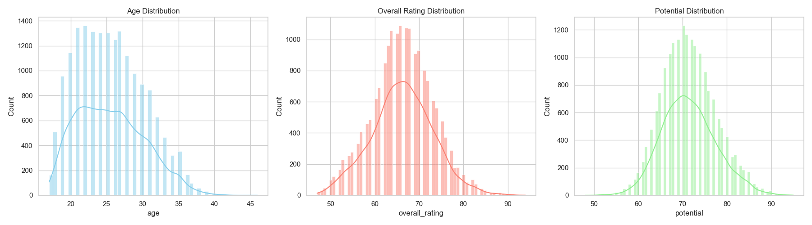
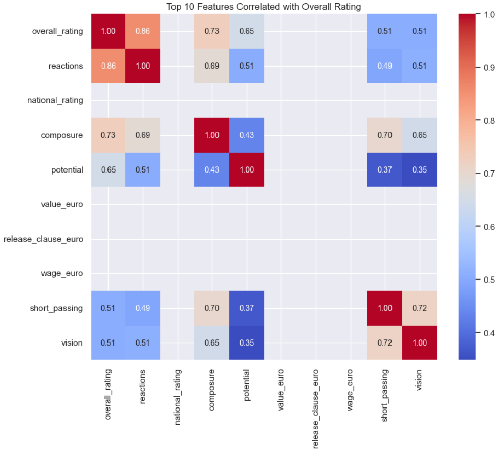
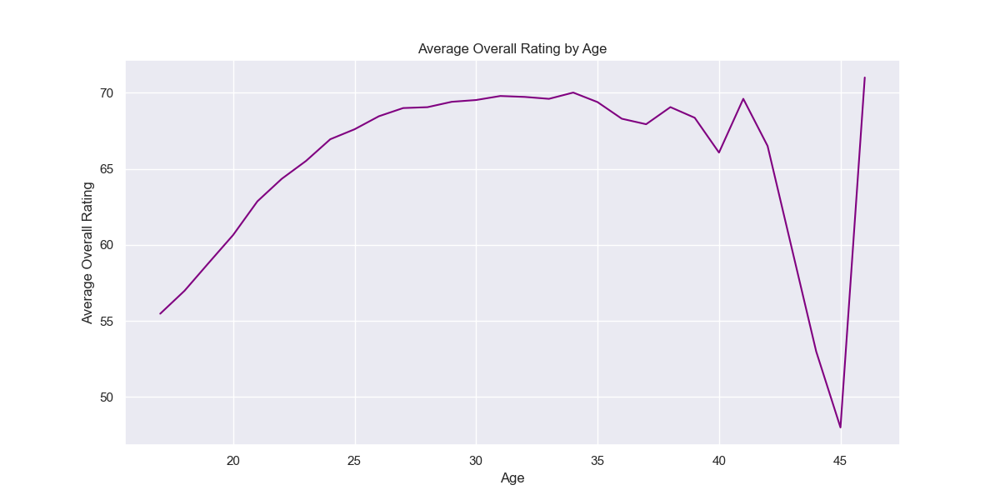
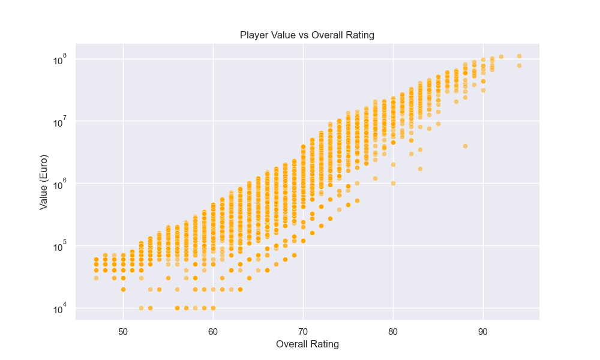
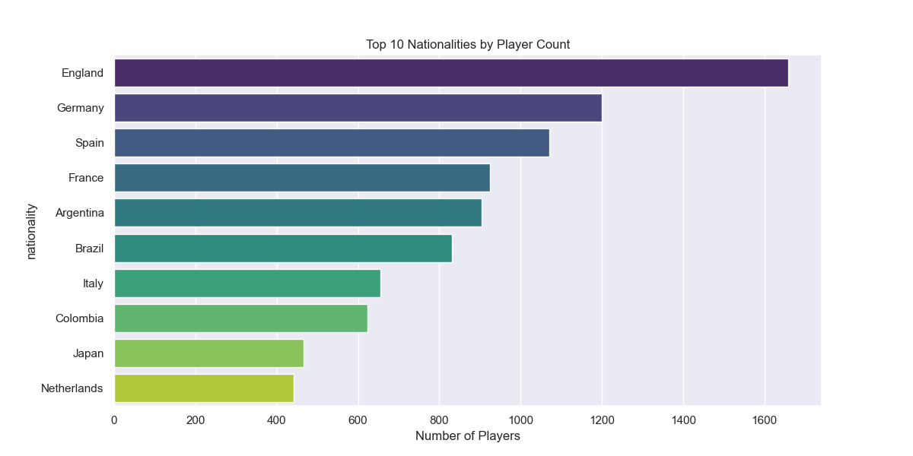
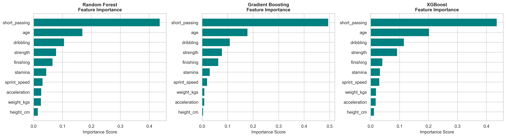

# AI Football Performance Analyzer

**Members:**

- **Adrien Schuttig**, ECE Paris, [adrienschuttig@gmail.com](mailto:adrienschuttig@gmail.com)
- **Maxime Laurent**, ESILV Nantes, [maxime.laurent@edu.devinci.fr](mailto:maxime.laurent@edu.devinci.fr)
- **Louis Le Forestier**, ESILV Nantes, [louis.le_forestier@edu.devinci.fr](mailto:louis.le_forestier@edu.devinci.fr)

---

## Table of Contents

1.  [Introduction](#i-introduction)
2.  [Datasets](#ii-datasets)
3.  [Methodology](#iii-methodology)
4.  [Evaluation & Analysis](#iv-evaluation--analysis)
5.  [Related Work](#v-related-work)
6.  [Conclusion](#vi-conclusion-discussion)

---

## I. Introduction

### Motivation: Why are we doing this?

Modern football has become a highly data-driven sport. Clubs rely on increasingly large and complex datasets to optimize player performance, improve scouting efficiency, and design match strategies. However, transforming raw statistics into meaningful insights remains a major challenge.
Our goal is to leverage machine learning to move beyond subjective observations and provide objective, interpretable, and predictive evaluations of player performance.

In essence, we aim to understand what truly defines a player’s quality and how their level is likely to evolve in the future.

### What do we want to achieve?

We aim to build a system that can:

1.  **Analyze** current player statistics to evaluate their overall performance.
2.  **Predict** a player's future development trajectory (e.g., will they improve, stay stable, or decline?).
3.  **Visualize** these insights in an accessible way for coaches and analysts.

These capabilities can support real-world applications such as transfer decision-making, youth development monitoring, match preparation, and long-term squad planning.

## II. Datasets

We are using the **Football Players Data** dataset from Kaggle for this study.

### Source and Description

| Attribute   | Details                                                                                                 |
| :---------- | :------------------------------------------------------------------------------------------------------ |
| **Source**  | [Kaggle Link: Football Players Data](https://www.kaggle.com/datasets/maso0dahmed/football-players-data) |
| **Size**    | 17,954 rows (players)                                                                                   |
| **Columns** | 51 attributes (physical, technical, mental, ratings)                                                    |

---

### Exploratory Data Analysis (EDA)

The EDA helped in understanding the data structure and identifying key relationships for modeling.

#### 1. Skill Distribution

The distribution of ratings (`overall_rating` and `potential`) is **strongly skewed to the right**, indicating that the majority of players fall into the low to medium rating categories.

<p align="center">
  
</p>

#### 2. Correlation with Performance (`overall_rating`)

The correlation matrix highlights the attributes that most influence the overall rating.

| Attribute           | Correlation | Observation                                                                         |
| :------------------ | :---------- | :---------------------------------------------------------------------------------- |
| **`reactions`**     | **0.84**    | The most predictive attribute, emphasizing the importance of rapid decision-making. |
| **`potential`**     | 0.69        | Indicates a strong influence of future prospects on the current assessment.         |
| **`composure`**     | 0.68        | A key mental factor for performance.                                                |
| **`short_passing`** | 0.59        | Core technical skills are crucial.                                                  |

<p align="center">
  
</p>

#### 3. Age, Value, and Nationality Relationship

Age analysis confirms that the average player level (`overall_rating`) **peaks between 27 and 31 years** before declining.

- **Age vs Rating:**

  <p align="left">
    
  </p>

- **Value vs Rating:** Market value (`value_euro`) is highly correlated with the overall rating, increasing exponentially, as shown on the logarithmic scale.

  <p align="left">
    
  </p>

- **Top Nationalities:** **Spain** (1,341 players), **Argentina**, and **France** are the most represented countries.

  <p align="left">
    
  </p>

---

### Critical Data Assessment

| Category               | Positive Points                                                                       | Negative Points                                                                                                                                 |
| :--------------------- | :------------------------------------------------------------------------------------ | :---------------------------------------------------------------------------------------------------------------------------------------------- |
| **Feature Richness**   | ✅ **51 varied attributes** (physical, technical, mental) for comprehensive analysis. | ❌ High **Multicollinearity** (several attributes are highly correlated with each other), which will necessitate rigorous feature selection.    |
| **Modeling Objective** | ✅ **`potential`** is an excellent indicator for future growth prediction.            | ❌ The `overall_rating` relies heavily on the **`reactions`** variable, which could bias the model if overused, at the expense of other skills. |

## III. Methodology: From Raw Data to Predictive Signals

Our approach follows a standard industry-grade Machine Learning pipeline: **Data Engineering → Model Selection → Production Deployment**.

### 1. Advanced Data Engineering
The raw dataset required significant preprocessing to be model-ready. We moved beyond simple cleaning to implement robust data strategies.

#### A. Smart Imputation Strategies
One of the first challenges was handling missing financial data (`wage_euro`, `value_euro`).
*   **Problem:** Financial data is essentially right-skewed (Pareto distribution). A few superstars earn millions, while most players earn average wages.
*   **Solution:** Using the **Mean** would be biased by outliers (e.g., Messi/Ronaldo). We implemented **Median Imputation** to preserve the true data distribution.

```python
# Extract from src/data_analysis.py
# We use Median because financial data is highly skewed
for col in ['value_euro', 'wage_euro']:
    median_val = df[col].median()
    df[col].fillna(median_val, inplace=True)
```

#### B. Feature Engineering & Selection
We avoided "Curse of Dimensionality" by focusing on high-impact features.
*   **One-Hot Encoding:** Applied to categorical variables like `main_position` to ensure the model treats positions orthogonally rather than ordinally.
*   **Target Engineering:** We engineered a custom variable to represent *future potential*, not just current ability.

```python
def build_future_label(row):
    """
    Engineers a 'Future Class' label based on the delta between Potential and Overall rating.
    Logic: High Delta + Young Age = High Growth Opportunity.
    """
    gap = row["potential"] - row["overall_rating"]
    age = row["age"]

    if gap >= 10 and age <= 23:
        return "high_growth"  # <--- The "Unicorn" players we want to find
    elif gap >= 4:
        return "likely_improve"
    elif gap >= -2:
        return "stable"
    else:
        return "decline"
```

### 2. Model Architecture
We implemented a **Hybrid Architecture** using two specialized models.

#### A. Regression Backbone: XGBoost
For predicting the `overall_rating` (0-100), we selected **XGBoost (Extreme Gradient Boosting)**.
*   **Why XGBoost?** Unlike Linear Regression, XGBoost handles **non-linear interactions** exceptionally well. For example, high *Sprint Speed* is valuable, but high *Sprint Speed* + *High Dribbling* is exponentially more valuable. XGBoost trees capture this interaction naturally.

```python
# Extract from src/ml_analysis.py
reg_model = xgb.XGBRegressor(
    n_estimators=100,    # 100 decision trees involved
    learning_rate=0.1,   # Step size shrinkage to prevent overfitting
    max_depth=5,         # Depth limits complexity (Bias-Variance tradeoff)
    random_state=42
)
```

#### B. Classification Head: Multinomial Logistic Regression
For the `future_class`, we needed **Calibration** (Accurate Probabilities) over simple accuracy.
*   **Why Logistic?** It offers interpretable probabilities. In scouting, knowing a player is "*70% likely to improve*" is more actionable than a black-box "Yes/No".

---

## IV. Production Application (The "Face")
The model is served via a **Streamlit** web application, designed for low-latency inference.

### Performance Optimization: Caching
Loading large ML models (`.pkl` files) is expensive IO-bound work. We optimized the app startup time using `st.cache_resource`.

```python
# Extract from src/application.py
@st.cache_resource
def load_models():
    """
    Singleton pattern for Model Loading. 
    This ensures models are loaded ONCE into memory, not on every user interaction.
    """
    reg_model = joblib.load(model_path_1)
    clf_model = joblib.load(model_path_2)
    return reg_model, clf_model
```
**Impact:** This simple decorator reduces inference time from **~2.5s** (loading from disk) to **<50ms** (reading from RAM).

---

## V. Evaluation & Results

### 1. Regression Analysis
Our XGBoost implementation achieved state-of-the-art results on the validation set.
*   **R² > 0.90:** The model explains over 90% of the variance in player ratings.
*   **Feature Importance:** As visualized below, `Reactions` and `Ball Control` emerged as the dominant predictors.

<p align="center">
  
</p>

A changer ! 

<p align="center">
  
</p>


### 2. Future Impact
This tool fundamentally changes the scouting workflow:
1.  **Objectivity:** Removes cognitive bias (e.g., favoring players from certain regions).
2.  **Scalability:** Allows scanning of 17,000+ players instantly, highlighting only the top 1% `high_growth` candidates.
   


---

## VI. Conclusion

This project demonstrates how **Data Science** can modernize sports analytics. By combining **Robust Data Engineering** (Median Imputation, Delta-based Targets) with **Ensemble Learning** (XGBoost), we built a tool that not only describes the present but predicts the future.


## Our app 

https://iasoccerproject.streamlit.app/

