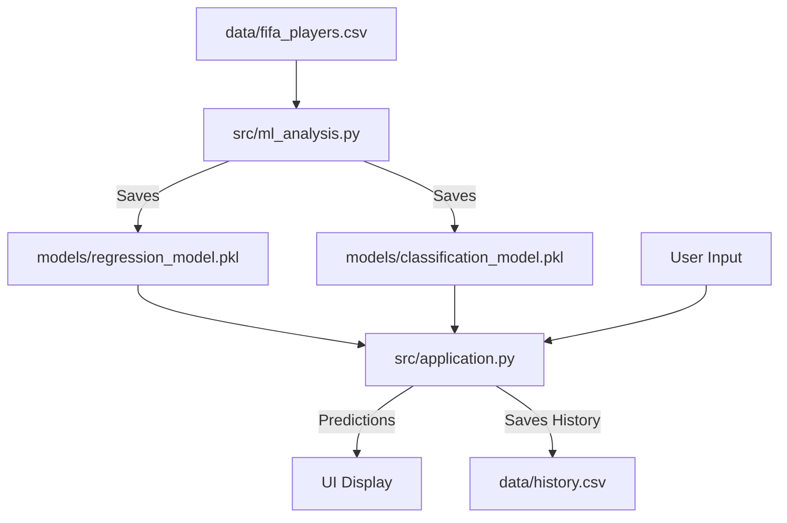

# Project Code Explanation

**Last Update:** December 2025

This document serves as the central guide to the **AI Football Scout** codebase. It provides an overview of how the different scripts interact and detailed explanations of their logic.

For deep dives into the main components, please refer to the specific documentation:
*   📘 **[Explanation of ml_analysis.py](explication%20application/ml_analysis.md)** (Model Training)
*   📘 **[Explanation of application.py](explication%20application/application.md)** (User Interface)
*   📘 **[Explanation of data_analysis.py](explication%20application/data_analysis.md)** (Experimental Script)

---

## 1. Project Architecture

The project is divided into **three main stages**:

1.  **Data Analysis & Experimentation**: Understanding the data and testing ideas (`data_analysis.py`, notebooks).
2.  **Machine Learning Operations (MLOps)**: Training the final models and saving them (`ml_analysis.py`).
3.  **Application Deployment**: The interactive usage of the models (`application.py`).

### Data Flow Diagram

---

## 2. Core Scripts

### 🧠 `src/ml_analysis.py` (The "Brain")
*   **Purpose**: This is the production training script. It runs once to generate the AI models.
*   **Key Actions**:
    *   Loads and cleans the FIFA dataset.
    *   Trains an **XGBoost Regressor** to predict overall ratings.
    *   Trains a **Logistic Regression** classifier to predict career trajectory (Future Class).
    *   Saves the trained models to the `models/` directory for the app to use.
*   **Detailed Guide**: [Read more here](explication%20application/ml_analysis.md).

### 🖥️ `src/application.py` (The "Face")
*   **Purpose**: This is the Streamlit web application that users interact with.
*   **Key Actions**:
    *   Loads the pre-trained models from `ml_analysis.py`.
    *   Provides a simple form for scouting new players.
    *   Visualizes player stats and predictions (Ratings, Probabilities).
    *   Saves scouted players to a local database (`history.csv`).
*   **Detailed Guide**: [Read more here](explication%20application/application.md).

---

## 3. Utility & Experimental Scripts

### 🔬 `src/data_analysis.py`
*   **Purpose**: An exploratory script used for testing different approaches before finalizing the main application.
*   **How it differs**:
    *   It uses a **Random Forest** model instead of XGBoost.
    *   It performs extensive data cleaning experiments (e.g., imputing missing wages with median values).
    *   It calculates financial metrics (Market Value analysis) which are not yet in the main app.
*   **Detailed Guide**: [Read more here](explication%20application/data_analysis.md).
*   **Use Case**: Run this if you want to see statistical summaries of the dataset or test model variations.

### 🛠️ `src/test_setup.py`
*   **Purpose**: A diagnostic tool ensuring your environment is ready.
*   **Key Actions**:
    *   Checks if `fifa_players.csv` exists.
    *   Checks if Python libraries (pandas, sklearn, xbox) are installed.
    *   Checks if the models (`.pkl`) have been generated.
    *   Runs a dummy prediction to verify everything works.
*   **How to run**: `python src/test_setup.py`
*   **Use Case**: Run this whenever you set up the project on a new computer or fix errors.

---

## 4. Notebooks (Interactive Analysis)

### `src/notebooks/ml_analysis.ipynb`
*   An interactive version of the training script. Useful for visualizing graphs (Learning Curves, Feature Importance) step-by-step without running the full pipeline.

### `src/notebooks/analyse.ipynb`
*   Focused on **Exploratory Data Analysis (EDA)**. Contains histograms, correlation heatmaps, and identifying trends (e.g., "At what age do players peak?").

---

## 5. Summary Table

| File | Type | Primary Role |
| :--- | :--- | :--- |
| `ml_analysis.py` | **Backend** | Train AI & Save Models |
| `application.py` | **Frontend** | User Interface (Streamlit) |
| `data_analysis.py` | **Research** | Data Cleaning & Model Experiments |
| `test_setup.py` | **Utility** | Health Check & Debugging |
| `fifa_players.csv` | **Data** | Raw Training Data |
| `history.csv` | **Database** | Saved User Predictions |
