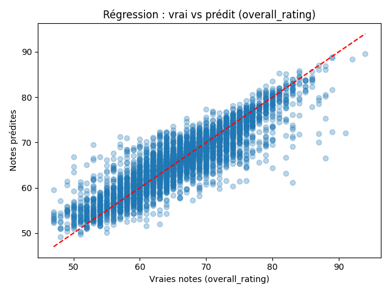

# Analysis of Advanced Machine Learning Models

This document provides a detailed explanation of the code and findings from the `ml_advanced_models.ipynb` notebook. The goal of this analysis is to evaluate advanced machine learning models for predicting player ratings and future development potential using the FIFA players dataset.

## 1. Overview and Data Preparation

The notebook begins by loading the dataset (`fifa_players.csv`) and preparing it for analysis.

**Key Steps:**
*   **Data Loading**: The dataset contains attributes for 17,954 players.
*   **Feature Selection**: Key physical and technical attributes are selected as features: `age`, `height_cm`, `weight_kgs`, `finishing`, `dribbling`, `short_passing`, `acceleration`, `sprint_speed`, `stamina`, and `strength`.
*   **Target Variables**:
    *   **Regression Target**: `overall_rating` (Predicting the player's current skill level).
    *   **Classification Target**: `future_class` (Predicting future growth trajectory).
*   **Future Class Engineering**: A new variable `future_class` is created based on the gap between a player's `potential` and `overall_rating`, categorized into:
    *   `high_growth`: Potential gap >= 10 (Young players with massive upside).
    *   `likely_improve`: Potential gap >= 4.
    *   `stable`: Small or no gap.
    *   `decline`: Negative gap (not used in final classification set).

---

## 2. Regression Analysis: Predicting Overall Rating

The first major task is to build a regression model that can accurately predict a player's `overall_rating` based on their attributes.

### Models Tested
We compared four different algorithms, ranging from simple to complex:
1.  **Linear Regression**: A baseline model.
2.  **Random Forest Regressor**: An ensemble method using multiple decision trees.
3.  **Gradient Boosting Regressor**: Builds trees sequentially to correct errors.
4.  **XGBoost Regressor**: An optimized gradient boosting library known for high performance.

### Results & Comparison
The models were evaluated using **R² (R-squared)** and **RMSE (Root Mean Squared Error)**.

*   **Linear Regression**: Performed poorly (R² ~0.47), indicating non-linear relationships in the data.
*   **Tree-based Models (RF, GB, XGB)**: All performed significantly better, with R² scores around 0.79-0.80.
*   **The Winner**: **XGBoost** achieved the best performance (R² = 0.7989), closely followed by Gradient Boosting.

*Figure 1: Comparison of Regression Models. XGBoost and Gradient Boosting show the lowest error (RMSE) and highest predictive accuracy (R²).*

The chart above clearly demonstrates the superiority of ensemble methods (Random Forest, Gradient Boosting, XGBoost) over the simple Linear Regression baseline.

*Figure 2: True vs Predicted Values. This scatter plot (if generated) would visualizes how close the predicted ratings are to the actual ratings.*

---

## 3. Feature Importance Analysis

Understanding *why* a model makes a prediction is as important as the prediction itself. We analyzed which features contributed most to the models' decisions.

### Key Factors
Across all tree-based models, the most influential features were consistent:
1.  **Short Passing**: The most critical technical skill for overall rating.
2.  **Age**: A major determinant of a player's career stage and rating.
3.  **Dribbling**: A key offensive attribute.

*Figure 3: Feature Importance by Model. 'Short Passing' dominates as the most predictive feature for a player's overall rating.*

---

## 4. Classification Analysis: Predicting Future Development

The second task is to classify players into growth categories: `stable`, `likely_improve`, or `high_growth`.

### Models Tested
1.  **Logistic Regression**: A robust baseline for classification.
2.  **Random Forest Classifier**
3.  **Gradient Boosting Classifier**
4.  **XGBoost Classifier**

### Results
*   **Performance**: All models performed very well, with accuracies around 88-89%.
*   **The Winner**: Surprisingly, **Logistic Regression** and **XGBoost** performed equally well (Accuracy ~0.8925). Logistic Regression is simpler and faster, making it a strong candidate, while XGBoost offers more robustness for complex data.

*Figure 4: Accuracy of Classification Models. All models achieved high accuracy, with Logistic Regression and XGBoost tied for top performance.*

---

## 5. Conclusions and Recommendations

### Summary of Findings
1.  **Regression**: **XGBoost** is the recommended model for predicting player ratings. It captures non-linear relationships effectively and outperforms simple linear models by a wide margin.
2.  **Classification**: **Logistic Regression** provides an excellent balance of accuracy and interpretability for predicting future growth classes, tying with XGBoost.
3.  **Drivers of Success**: **Short Passing** and **Age** are the most significant indicators of a player's current level.

### Recommendations for the Application
*   **Implementation**: Use **XGBoost** for the rating prediction engine due to its superior accuracy.
*   **Feature Focus**: When scouting or analyzing players, weight "Short Passing" and "Dribbling" heavily, as these are strong proxies for overall quality.
*   **Future Work**: Further hyperparameter tuning (as demonstrated in the notebook) can squeeze minor performance gains from XGBoost, but the current configuration is already highly effective.
